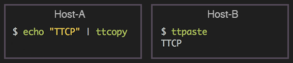

<p align="center">

</p>

[](https://github.com/greymd/ttcopy/releases/latest)
[](https://travis-ci.org/greymd/ttcopy)

# ttcopy: Trans-Terminal Copy/Paste

Provide copying and pasting within multiple hosts through the Web.



# Environment
  * zsh (tested ver: 4.3, 5.0)
  * bash (tested ver: 3.2, 4.2)

## Requirements
  * openssl
  * curl

# Installation
Set up `ttcopy` on the hosts which you want to make share same data.
Please follow the following instructions to install it.

## With [zplug](https://zplug.sh) (for zsh users)

If you are using zplug, it is easy and recommended way.
Add this line to `.zshrc`.

```sh
zplug "greymd/ttcopy"
```

That's all 🎉.

## With [Antigen](http://antigen.sharats.me/) (for zsh users)
The above way is almost same for the other plugin managers.
For example, add this line to `.zshrc` if you are using [Antigen](http://antigen.sharats.me/).

```sh
antigen bundle "greymd/ttcopy"
```

## Manual Installation

If you are not using `zplug` (includeing bash users), follow below steps

#### 1. Clone repository

```sh
$ git clone https://github.com/greymd/ttcopy.git ~/ttcopy
```

#### 2. Edit `.bashrc` or `.zshrc`

Add following lines.

```sh
source ~/ttcopy/ttcp_activate.sh
```

##### For advanced users

`ttcp_activate.sh` adds `ttcocpy/bin` to `$PATH`. Instead of using it, you can
copy `ttcopy/bin` and `ttcopy/lib` somewhere you want to place then make sure
`ttcopy/bin` be listed under `$PATH`.

For example,

```sh
cp -rf ~/ttcopy/bin ~/ttcopy/lib /usr/local

echo "export PATH=$PATH:/usr/local/bin" >> ~/.zshrc" # if you need
```

# Configuration
First of all, `ttcopy` command displays the screen to let you set default ID and Password.
Please prepare ID and Password **as you like**. Be lazy! You are **NOT** required to register them on any services.
The data you copied can be pasted within the hosts having same ID and Password.

```sh
$ ttcopy
Set default ID/Password.
Enter ID for ttcopy/ttpaste: myid001   #<= Enter your ID ("myid001" is just an example).
Enter password for ttcopy/ttpaste:    #<= Enter your password.
Enter same password again:            #<= Enter again.

Created credential file '/home/user/.config/ttcopy/config'
Execute 'ttcopy --init' to show this screen again.
```

# Examples

### Copy & Paste within multiple hosts!

* Host1
```sh
$ echo foobar | ttcopy
```

* Host2
```sh
$ ttpaste
foobar
```

### Clip binary data.

* Host1
```sh
$ cat image.jpg | ttcopy
```

* Host2
```sh
$ ttpaste | file -
/dev/stdin: JPEG image data, JFIF standard 1.01
```

# Features

## Options

`ttcopy` and `ttpaste` commands support following options.

```
$ ttcopy --help
  Usage: ttcopy [OPTIONS]

  OPTIONS:
  -h, --help                         Output a usage message and exit.
  -V, --version                      Output the version number of ttcopy and exit.
  -i ID, --id=ID                     Specify ID to identify the data.
  -p PASSWORD, --password=PASSWORD   Specify password to encrypt/decrypt the data.
  --init                             Set default ID and password.
```

Use non-default ID and password.

```
$ seq 10 | ttcopy -i abcdef -p ghijklmn
Copied!
```

```
$ ttpaste -i abcdef -p ghijklmn
1
2
3
4
5
6
7
8
9
10
```

## Copy/Paste through proxy server

Commands load shell variable `TTCP_PROXY` as their proxy server for connection.

```sh
$ echo ABCDEFG | TTCP_PROXY="http://example.proxy.server1.com:1234" ttcopy
```

```sh
$ TTCP_PROXY="http://example.proxy.server2.com:5678" ttpaste
ABCDEFG
```

It is helpful to add this line to `.bashrc` or `.zshrc` if you are always using specific proxy server.

```sh
export TTCP_PROXY="http://example.proxy.server1.com:1234"
```

## LICENSE

This is available as open source under the terms of the [MIT License](http://opensource.org/licenses/MIT).
